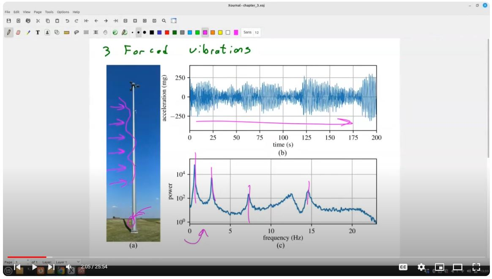

# Open Vibrations
An open-source textbook intended to cover the basics of mechanical vibrations. This text is intended to function as the only text required for a college (undergraduate) class on vibrations. 

 Cover image for the text.  

A current PDF version of the text can be found in the releases tab of the GitHub page or by clicking <a href="https://github.com/austindowney/Open-Vibrations/blob/main/Open_Vibrations.pdf">here</a>.

## Accompanying Video Lecture

Videos of lectures associated with this text are available as a YouTube playlist <a href="https://www.youtube.com/playlist?list=PL-2wJog-EC58uXz1LhpNRmV8nCEvyvoVS">here</a>.

  

 Screenshot of the video lecture that accompanies this repository which can be found <a href="https://www.youtube.com/playlist?list=PL-2wJog-EC58uXz1LhpNRmV8nCEvyvoVS">here</a>.  

## License

This work is licensed under a Creative Commons Attribution-ShareAlike 4.0 International License [cc-by-sa 4.0].

## Citation

Cite as  
@Misc{DowneyOpenVibrations,  
  author = {Austin Downey and Laura Micheli},  
  title  = {Open Vibrations},  
  url    = {https://github.com/austindowney/Open-Vibrations},  
}  

